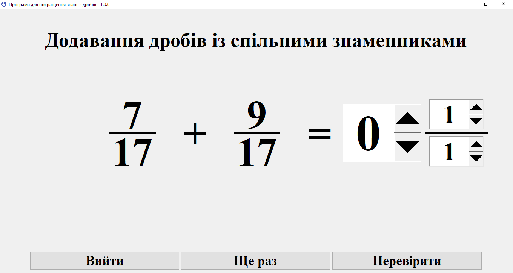

# Математичний тренажер для вивчення звичайних дробів
> [!NOTE]
> An [English](README_ENG.md) version of this document is available.


Ця програма розроблена для навчання та вдосконалення розуміння дробів. Програма містить інтерактивні завдання, які допоможуть користувачам вдосконалити свої навички у роботі з дробами. 

Вона складається з 4 тем, кожна з них має декілька підтем:
* Додавання дробів
    * Додавання дробів з однаковими знаменниками
    * Додавання дробів із різними знаменниками
    * Додавання мішаних чисел
* Віднімання дробів
    * Віднімання дробів з однаковими знаменниками
    * Віднімання дробів із різними знаменниками
    * Віднімання мішаних чисел
* Множення дробів
    * Множення дробу на натуральне число
    * Множення дробів із різними знаменниками
    * Множення мішаних чисел
* Ділення дробів
    * Ділення дробу на натуральне число
    * Ділення натурального числа на дріб
    * Ділення дробів із різними знаменниками
    * Ділення мішаних чисел



## Особливості
* Завдання генеруються випадковим чином, але з обмеженнями щоби дріб завжди був правильний та щоби при відніманні не було від'ємних дробів(програма розроблена для учнів 5-6 класів які не вивчають від'ємні дроби).
* Якщо у результаті обчислення вийшло ціле число, користувач може приховати дробову частину натиснувши на кнопку "Приховати", значення які були введені раніше зберігаються.
* Коли користувач правильно розв'язує завдання з'являється вікно з смайликом:


## Доступні мови
* Українська

## Доступні платформи
Ця програма написана на мові [Python 3.9.7](https://www.python.org/downloads/release/python-397/) з використанням вбудованого модуля [tkinter](https://docs.python.org/uk/3/library/tkinter.html) та модуля [pillow](https://pypi.org/project/pillow/). 

Якщо ви знайшли помилку повідомте про це на сторінці [Issues](https://github.com/AntynK/FractionsQuizApp/issues).

> [!IMPORTANT]
> Програма працює лише на Python 3.9 та новіших версіях.


## Як почати

### Спосіб 1: Завантажити вихідний код
> [!IMPORTANT]
> У вас має бути встановлений [інтерпритатор мови Python](https://www.python.org/downloads/release/python-397/).

> [!IMPORTANT]
> Потрібно встановити залежності за допомогою команди `pip install -r requirements.txt`

1. Відкрийте сторінку [релізів](https://github.com/AntynK/FractionsQuizApp/releases/latest).
2. Завантажте архів `SourceCode.zip`.
3. Розпакуйте його.
4. Запустіть файл `main.py`, двічі натиснувши по ньому або через команду:

#### Windows:
```bash 
python main.py
```
#### Linux та MacOS:
```bash
python3 main.py
```

> [!IMPORTANT]
> Деякі дистрибутиви Linux не містять пакет `tkinter`, у такому випадку ви отримаєте помилку `ImportError`, щоби виправити це спробуйте інсталювати пакет `python-tk` через менеджер пакетів до прикладу `apt`.


### Спосіб 2: Завантажити виконуваний файл
> [!WARNING]
> Антивірус Windows може розпізнати виконуваний файл як загрозу, якщо ви переживаєте спробуйте запустити вихідний код(Спосіб 1).

1. Відкрийте сторінку [релізів](https://github.com/AntynK/FractionsQuizApp/releases/latest).
2. Завантажте файл `FractionsQuizApp.exe`.
3. Запустіть його.


## Контриб'ютори
Якщо у вас є ідеї щодо покращення чи бажання долучитися до розвитку проєкту, будь ласка, подайте свій внесок. Відкрийте [CONTRIBUTING.md](CONTRIBUTING.md) для детального ознайомлення.

## Збирання (лише Windows)
Для збирання використовується [Pyinstaller](https://pyinstaller.org/en/stable/). 
Його можна встановити за допомогою команди:

#### Windows
```bash 
pip install -U pyinstaller
```

Після цього запустіть процес збирання командою:

#### Windows
```bash 
pyinstaller build.spec
```

У результаті буде створено папку `dist`, у якій міститиметься виконуваний файл.